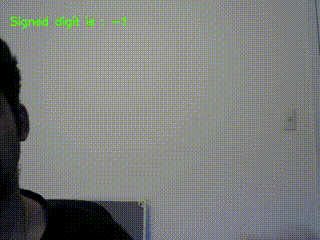

# SGCN Sign Digit Recognizer

Sign digit recognizer built on spatial graph convolutional networks, that can recognize sign digits 
from 0 to 9 signed over a webcam or static images.



## Getting Started
### Prerequisites
+ Python3
+ Tensorflow (v2.1.0 +)
+ OpenCV (v3.4.1 +)
+ CUDA (10.1 +)
+ CuDNN (7.6.4)
+ [Openpose](https://github.com/CMU-Perceptual-Computing-Lab/openpose) with python api

The project was trained and tested on Nvidia RTX 2060 6GB card

## Setup
### Dataset Preprocessing

Dataset used is [Sign-Language-Digits-Dataset](https://github.com/ardamavi/Sign-Language-Digits-Dataset)

For preprocessing the dataset, run the below command with preproc.yaml appropriately filled

```python main.py preprocessing -c configs/preproc.yaml```

The preprocessed data is stored in the work directory as specified in the config file

### Training

For training on the preprocessed data, run the below command with train.yaml appropriately filled

```python main.py training -c configs/train.yaml```

Run the below command to start tensorboard for realtime tracking of training accuracy and other parameters

```tensorboard --logdir logs```

### Recognition (Webcam)

For live recognition over webcam, run the below command with realtime.yaml appropriately filled

```python main.py recognition_webcam -c configs/realtime.yaml```